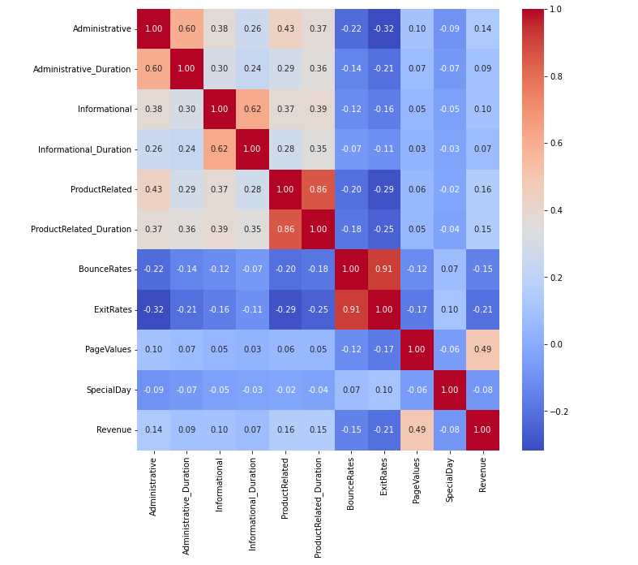
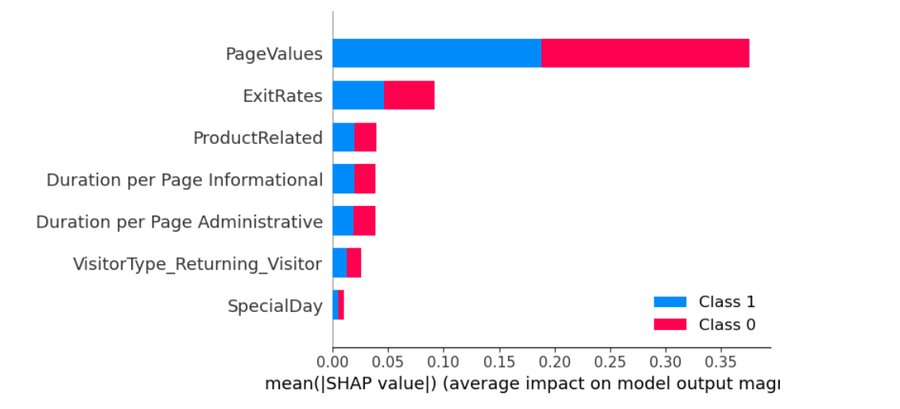
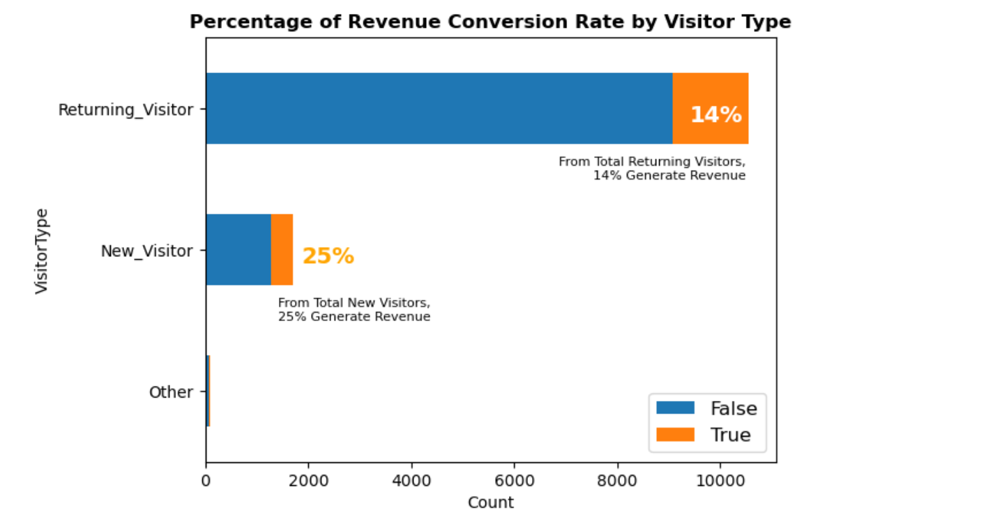
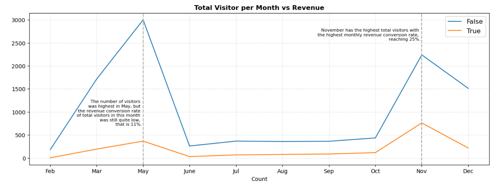

# 🛒 ONLINE SHOPPERS PURCHASING INTENTION

### **Predicting whether an online visitor is likely to make a purchase**

> An end-to-end **EDA → Preprocessing → Feature Engineering → Machine Learning → Model Interpretation → Business Recommendations** project.

---

## 📌 PROJECT OVERVIEW

Majestic is an e-commerce marketplace with a **15% website conversion rate**.

This project analyzes online visitor behavior and develops a machine learning approach to identify sessions with higher purchase potential.

### 🎯 OBJECTIVES

- **UNDERSTAND** customer browsing behavior
- **IDENTIFY** factors associated with purchasing
- **PREDICT** purchase intention
- **TRANSLATE** model findings into business recommendations

### 📊 BUSINESS METRIC

**Revenue Conversion Rate**

---

## 📂 DATASET

- **12,330** online shopping sessions
- **18** features
- Target variable: **Revenue**
- **125 duplicate records** identified and removed
- Class imbalance addressed during preprocessing

---

## 🔍 EXPLORATORY DATA ANALYSIS

### KEY FINDINGS

- Numerical variables are generally **positively skewed** with long-tailed distributions.
- Several numerical variables contain **outliers**.
- **Returning Visitors** account for the majority of sessions.
- **New Visitors** show a higher conversion rate of approximately **25%**.
- **May** has the highest traffic, while **November** reaches approximately **25% conversion**.
- **PageValues** has the strongest positive relationship with Revenue among the variables shown.
- **BounceRates** and **ExitRates** have negative relationships with Revenue.

### 🔗 CORRELATION & MULTICOLLINEARITY

Key relationships identified during EDA include:

- `ProductRelated` ↔ `ProductRelated_Duration` = **0.86**
- `BounceRates` ↔ `ExitRates` = **0.91**
- `PageValues` ↔ `Revenue` = **0.49**



*Figure 1 — Correlation heatmap of numerical variables.*

---

## ⚙️ DATA PREPROCESSING

### 🧹 DATA CLEANING

- Replaced **"Other" VisitorType** with **"Returning Visitor"**
- Removed **125 duplicate records**
- Investigated outliers using **Z-score analysis**
- Retained identified outliers where they were considered valid observations

### 🔄 TRANSFORMATION & FEATURE ENGINEERING

- Applied **Yeo-Johnson Power Transformation** to address skewness
- Applied **One-Hot Encoding** to categorical variables
- Created duration-per-page features for:
  - **Administrative pages**
  - **Informational pages**
  - **Product pages**
- Reduced redundancy caused by highly correlated variables

### ⚖️ TRAINING SETUP

- **70% Training / 30% Testing**
- **SMOTE** applied to the training data

---

## 🤖 MACHINE LEARNING MODEL

Multiple classification approaches were evaluated, with **Random Forest** selected as the final model after hyperparameter tuning.

### 🏆 MODEL PERFORMANCE

| METRIC | TRAIN | TEST |
|---|---:|---:|
| **Accuracy** | 0.86 | **0.87** |
| **Recall** | 0.80 | **0.79** |
| **ROC-AUC** | **0.90** | **0.90** |

**ROC-AUC = 0.90** indicates strong ability to distinguish between purchasing and non-purchasing sessions.

---

## 🌟 MODEL INTERPRETATION — SHAP

SHAP analysis was used to understand **which features most influenced model predictions**.

### 🔝 TOP FEATURES

1. **PageValues**
2. **ExitRates**
3. **ProductRelated**
4. **Duration per Page Informational**
5. **Duration per Page Administrative**



*Figure 2 — SHAP feature importance showing the average impact of the main features on model output.*

### 💡 MODEL INSIGHTS

- **Higher PageValues** → stronger purchase signal
- **Higher ProductRelated activity** → positive contribution toward purchase prediction
- **Higher ExitRates** → negative contribution toward purchase prediction

---

## 💼 BUSINESS INSIGHTS

### 👥 VISITOR TYPE

- Returning Visitors dominate website traffic.
- **New Visitors convert at approximately 25%**, compared with approximately **14% for Returning Visitors**.



*Figure 3 — Revenue conversion rate by visitor type.*

### 📅 MONTHLY TRAFFIC & CONVERSION

- **May** has the highest visitor traffic, but its conversion rate is approximately **11%**.
- **November** shows the strongest monthly conversion performance at approximately **25%**.



*Figure 4 — Monthly visitor traffic and purchasing sessions.*

### 💰 PAGEVALUES

- **PageValues > 0** is strongly associated with purchasing.
- Sessions with **PageValues > 0** show approximately **56% purchased** versus **4% when PageValues = 0**.

---

## 📢 BUSINESS RECOMMENDATIONS

### 🤖 MODEL-DRIVEN

- Prioritize products and sessions associated with **higher PageValues**.
- Improve **product-page quality and ranking**.
- Optimize content to increase **visitor engagement**.
- Monitor **ExitRates** as a potential indicator of weaker purchase intent.

### 📊 DATA-DRIVEN

- Focus campaigns around **high-performing months**, particularly **November**, while also considering May, March, and December based on traffic and purchasing patterns.
- Increase **New Visitor acquisition** through targeted marketing.
- Consider **first-time visitor offers or discounts** to encourage conversion.

---

## 🔄 PROJECT WORKFLOW

```text
RAW DATA
   ↓
EXPLORATORY DATA ANALYSIS
   ↓
DATA CLEANING
   ↓
FEATURE ENGINEERING
   ↓
TRANSFORMATION & ENCODING
   ↓
TRAIN-TEST SPLIT + SMOTE
   ↓
RANDOM FOREST + HYPERPARAMETER TUNING
   ↓
MODEL EVALUATION
   ↓
SHAP INTERPRETATION
   ↓
BUSINESS INSIGHTS & RECOMMENDATIONS
```

---

## 🛠️ TECHNOLOGIES

- **Python**
- **Pandas**
- **NumPy**
- **Matplotlib**
- **Seaborn**
- **Scikit-learn**
- **XGBoost**
- **SHAP**
- **Jupyter Notebook**

---

## 📁 PROJECT STRUCTURE

```text
online-shoppers-purchasing-intention/
│
├── notebooks/
│   ├── 01_eda.ipynb
│   ├── 02_preprocessing.ipynb
│   └── 03_modeling.ipynb
│
├── images/
│   ├── shap_feature_importance.png
│   ├── correlation_heatmap.png
│   ├── visitor_type_conversion.png
│   └── monthly_traffic_conversion.png
│
└── README.md
```

---

## 🎯 KEY TAKEAWAY

This project demonstrates an **end-to-end machine learning workflow** for an e-commerce purchase-intention problem — from understanding visitor behavior and preparing the data to building a predictive model, interpreting its decisions, and converting the findings into actionable business recommendations.

---

## 👤 AUTHOR

### **SHAMIR HAVAS**

**Aspiring Data Scientist | Machine Learning | Data Analytics**
